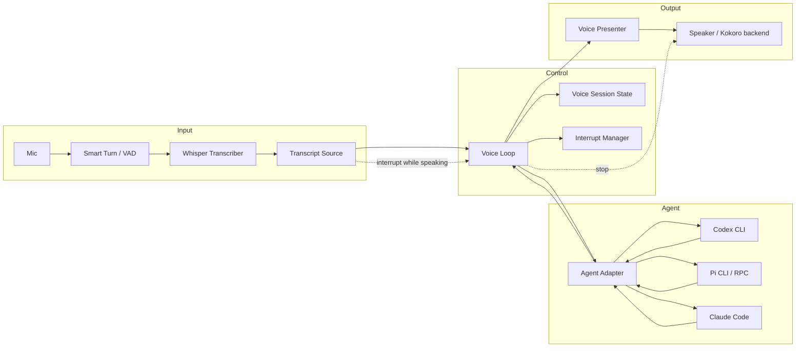
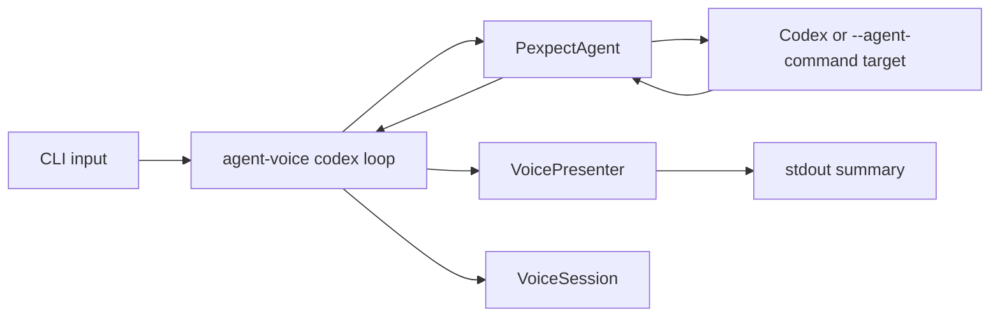
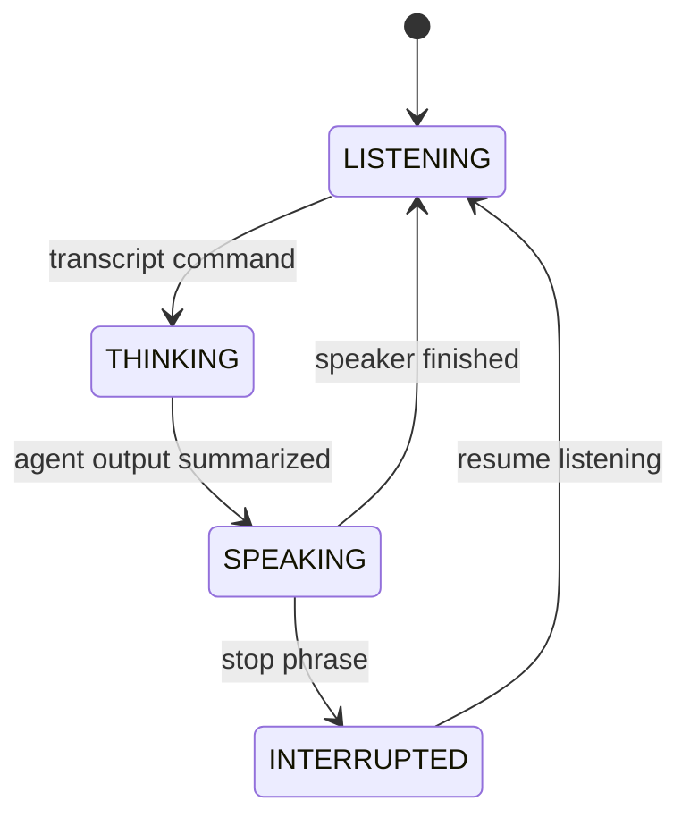

# Component Architecture

`agent-voice` is a local voice layer around terminal coding agents. The core
design is component-based: audio, agent control, presentation, and interruption
are separate boundaries.

## Target Components



## Component Responsibilities

| Component | Responsibility | Current Status |
| --- | --- | --- |
| `TranscriptSource` | Supplies completed user utterances from text, Whisper, or another input provider. | Not implemented. CLI currently uses `input("> ")` directly. |
| `VoiceLoop` | Coordinates transcript handling, agent submission, output collection, presentation, speaking, and interruption. | Not implemented as a standalone component. The CLI currently hardcodes a minimal loop. |
| `AgentAdapter` | Starts a coding agent, sends user input, and reads available agent output. | Implemented as `PexpectAgent`. |
| `VoicePresenter` | Converts raw agent output into short speech-ready summaries. | Implemented as rule-based summaries. |
| `Speaker` | Speaks presenter output and supports `stop()` for barge-in. Kokoro is the intended default TTS backend. | Not implemented as code yet. CLI currently prints summaries. |
| `InterruptManager` | Decides whether a transcript should interrupt speech in the current state. | Implemented as a predicate. Not wired into the CLI loop yet. |
| `VoiceSession` | Tracks `LISTENING`, `THINKING`, `SPEAKING`, and `INTERRUPTED`. | Implemented. Used by the CLI for basic state transitions. |

## Current MVP Component Map

The current implementation is the non-audio MVP:



Current files:

- `src/agent_voice/adapter.py`: `Agent` protocol and `PexpectAgent`
- `src/agent_voice/cli.py`: persistent Codex text loop and output collection
- `src/agent_voice/presenter.py`: speech summary generation
- `src/agent_voice/interrupt.py`: interrupt predicate and session state

## Target Voice Loop Contract

The next important architectural step is to turn the hardcoded CLI flow into a
testable `VoiceLoop`.

Kokoro is already the intended TTS engine. The missing piece is the local
`Speaker` component that wraps Kokoro behind a small interface, so the rest of
the voice loop can call `say(text)` and `stop()` without depending on Kokoro
internals.

Expected shape:

```python
class TranscriptSource(Protocol):
    def next_transcript(self) -> str | None: ...


class Speaker(Protocol):
    def say(self, text: str) -> None: ...
    def stop(self) -> None: ...


class VoiceLoop:
    def run_once(self) -> None: ...
```

The loop should own this decision:

```text
if session.state == SPEAKING and interrupt.should_interrupt(transcript, state):
    speaker.stop()
    session.interrupt()
    session.resume_listening()
else:
    session.heard_command()
    agent.submit(transcript)
    raw_output = collect_agent_output(agent)
    session.agent_responded()
    summary = presenter.summarize(raw_output)
    speaker.say(summary)
    session.tts_finished()
```

This is the point where fake end-to-end tests become meaningful: they can verify
the voice product loop instead of only verifying presenter output.

## Agent Adapter Strategy

### Codex

Codex is currently controlled through `PexpectAgent`.

```bash
uv run agent-voice codex
```

The adapter starts one long-lived Codex process and submits each transcript as
terminal input.

### Pi

Pi can currently be connected through the same pexpect fallback:

```bash
uv run agent-voice codex --agent-command pi
uv run agent-voice codex --agent-command "pi -c"
```

The stable target should be a dedicated Pi adapter:

```bash
uv run agent-voice pi
uv run agent-voice pi --continue
```

Prefer Pi's structured RPC or JSON event modes over TUI scraping. Structured
events are a better source for speech summaries, agent state awareness, and
interrupt behavior.

### Claude Code

Claude Code should follow the same adapter boundary. If only TUI control is
available, use a pexpect adapter. If structured events are available, prefer a
structured adapter.

## State Model



Default interrupt semantics:

- `잠깐`, `멈춰`, `stop`, or `pause` stops speech playback only.
- It should not cancel the coding agent by default.
- Future commands such as "그만해" or "cancel" can map to agent-level interrupt
  behavior like Ctrl-C.

## Testing Boundaries

Useful automated tests should match component ownership:

- Presenter tests: raw agent output to speech summary.
- Adapter tests: transcript text is submitted to the child process.
- VoiceLoop tests: transcript to agent to presenter to speaker, including
  speaking-time interruption.
- Real Codex/Pi tests: opt-in smoke tests only, because auth, latency, and model
  output are inherently flaky.
