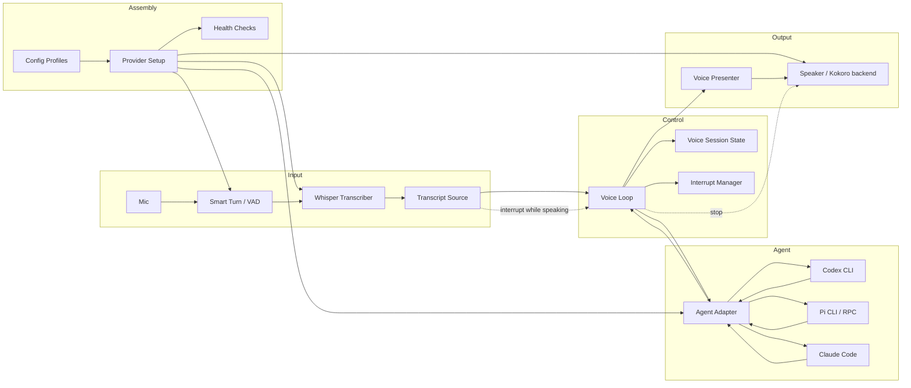
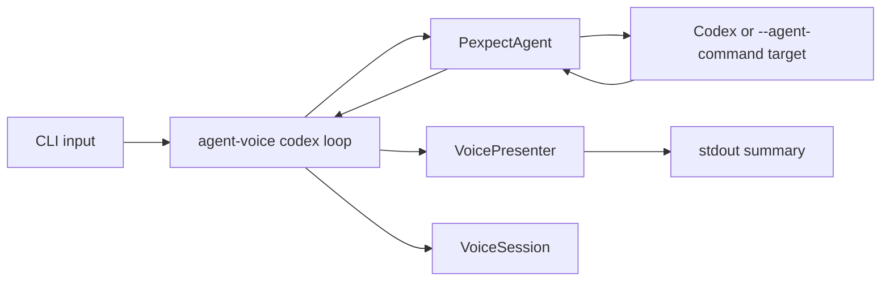
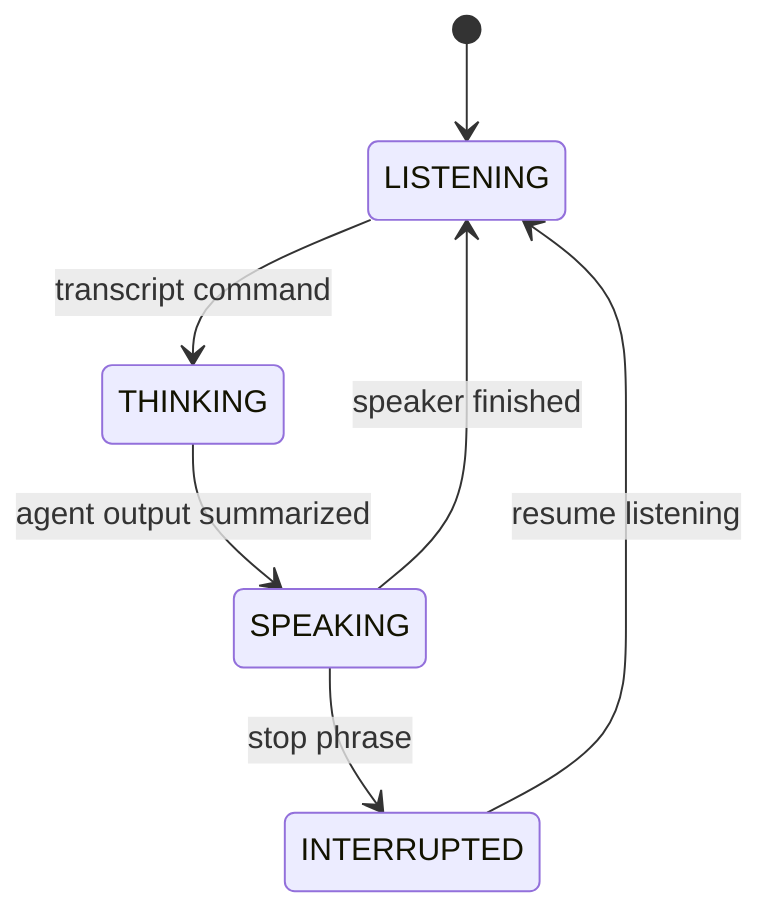

# Component Architecture

`agent-voice` is a local voice layer around terminal coding agents. The core
design is component-based: audio, agent control, presentation, interruption, and
provider assembly are separate boundaries.

The product value is not only the custom code. A large part of the value is
assembling compatible local components, setting sane defaults, and hiding the
rough edges between Smart Turn/VAD, Whisper, Kokoro, terminal agents, and
platform audio.

## Target Components



## Component Responsibilities

| Component | Responsibility | Current Status |
| --- | --- | --- |
| `TranscriptSource` | Supplies completed user utterances from text, Whisper, or another input provider. | Not implemented. CLI currently uses `input("> ")` directly. |
| `VoiceLoop` | Coordinates transcript handling, agent submission, output collection, presentation, speaking, and interruption. | Not implemented as a standalone component. The CLI currently hardcodes a minimal loop. |
| `AgentAdapter` | Starts a coding agent, sends user input, and reads available agent output. | Implemented as `PexpectAgent`. |
| `VoicePresenter` | Converts raw agent output into short speech-ready summaries. | Implemented as rule-based summaries. |
| `Speaker` | Speaks presenter output and supports `stop()` for barge-in. Kokoro is the intended default TTS backend. | Not implemented as code yet. CLI currently prints summaries. |
| `InterruptManager` | Decides whether a transcript should interrupt speech in the current state. | Implemented as a predicate. Not wired into the CLI loop yet. |
| `VoiceSession` | Tracks `LISTENING`, `THINKING`, `SPEAKING`, and `INTERRUPTED`. | Implemented. Used by the CLI for basic state transitions. |
| `ProviderSetup` | Installs, configures, validates, and starts external providers such as Smart Turn/VAD, Whisper, Kokoro, and agent adapters. | Not implemented. |
| `ConfigProfile` | Captures known-good local stack choices such as `local-cpu`, `apple-silicon`, `cuda`, `codex-only`, or `pi-rpc`. | Not implemented. |
| `HealthChecks` | Verifies mic access, model files, audio output, provider versions, agent command availability, and expected latency. | Not implemented. |

## Assembly Layer

The voice stack depends on several external components. `agent-voice` should
make those components feel like one product by managing configuration,
capability detection, startup order, and health checks.

Planned assembly responsibilities:

- Detect platform capabilities: OS, CPU/GPU, audio devices, Python version, and
  available agent CLIs.
- Select a profile: for example `local-cpu`, `apple-silicon`, `cuda`,
  `codex-pexpect`, or `pi-rpc`.
- Install or verify optional providers without forcing every dependency on
  every user.
- Download or locate model assets for Whisper, Smart Turn/VAD, and Kokoro.
- Validate that mic input, speaker output, and agent command execution work
  before starting the full loop.
- Start providers in the right order and expose clear diagnostics when one
  layer fails.

The intended user-facing shape:

```bash
uv run agent-voice doctor
uv run agent-voice setup --profile local-cpu
uv run agent-voice setup --profile apple-silicon
uv run agent-voice codex --voice
```

These commands are not implemented yet. They describe the product boundary:
`agent-voice` should assemble the local voice stack, not merely expose a set of
Python classes.

Current verified provider smoke:

```bash
uv run --extra voice-onnx python scripts/provider_smoke.py
```

This exercises Kokoro ONNX, faster-whisper, and Pipecat Smart Turn v3 together
without Torch/CUDA dependencies. It is a provider-level integration check, not a
full voice-loop E2E test.

## Replaceable Provider Design

Adapter pattern is the right starting point, but it should be applied as small
provider protocols instead of one large "voice provider" interface. Each
external component should sit behind the narrowest contract the voice loop
needs.

Provider protocols should be stable:

```python
class TurnDetector(Protocol):
    def accept_audio(self, chunk: AudioChunk) -> TurnDecision: ...


class Transcriber(Protocol):
    def transcribe(self, audio: AudioSegment) -> Transcript: ...


class Speaker(Protocol):
    def say(self, text: str) -> None: ...
    def stop(self) -> None: ...


class AgentAdapter(Protocol):
    def start(self) -> None: ...
    def submit(self, text: str) -> None: ...
    def read_available(self) -> str: ...
    def stop(self) -> None: ...
```

Concrete providers can then change without rewriting the voice loop:

| Boundary | Default Candidate | Replaceable With |
| --- | --- | --- |
| Turn detection | Pipecat Smart Turn / VAD | Silero VAD, WebRTC VAD, custom semantic turn detector |
| Transcription | Whisper | faster-whisper, whisper.cpp, platform STT |
| Speech | Kokoro | Piper, Coqui, system TTS, hosted TTS if explicitly configured |
| Agent control | `PexpectAgent` | Pi RPC adapter, Claude structured adapter, tmux adapter |
| Presentation | `VoicePresenter` | rule-based presenter, LLM-backed presenter, agent-specific presenter |

Provider selection should happen outside `VoiceLoop`. The loop should receive
already-constructed components:

```python
profile = ConfigProfile.load("local-cpu")
providers = ProviderRegistry(profile).build()
loop = VoiceLoop(
    transcript_source=providers.transcript_source,
    agent=providers.agent,
    presenter=providers.presenter,
    speaker=providers.speaker,
    interrupt=providers.interrupt,
)
```

This keeps the core loop independent from Kokoro, Whisper, Pipecat, Codex, Pi,
and Claude Code implementation details.

Provider metadata should include:

- `name`: human-readable provider name
- `kind`: `turn_detector`, `transcriber`, `speaker`, `agent`, or `presenter`
- `capabilities`: streaming, local-only, GPU support, interruption support,
  structured events, languages
- `health_check`: fast validation command or function
- `setup_hint`: actionable installation/configuration guidance

Compatibility rules:

- A provider can be replaced if it satisfies the same protocol.
- Optional provider-specific features must be exposed as capabilities, not
  hardcoded type checks.
- `VoiceLoop` must depend on protocols, not concrete provider classes.
- Provider setup can know about external tools and model files. Core runtime
  components should not own installation or download logic.

Current code already applies this idea to agents through the `Agent` protocol
and `PexpectAgent`. The same pattern still needs to be added for turn
detection, transcription, speech, provider setup, and health checks.

## Current MVP Component Map

The current implementation is the non-audio MVP:



Current files:

- `src/agent_voice/adapter.py`: `Agent` protocol and `PexpectAgent`
- `src/agent_voice/cli.py`: persistent Codex text loop and output collection
- `src/agent_voice/presenter.py`: speech summary generation
- `src/agent_voice/interrupt.py`: interrupt predicate and session state

## Target Voice Loop Contract

The next important architectural step is to turn the hardcoded CLI flow into a
testable `VoiceLoop`.

Kokoro is already the intended TTS engine. The missing piece is the local
`Speaker` component that wraps Kokoro behind a small interface, so the rest of
the voice loop can call `say(text)` and `stop()` without depending on Kokoro
internals.

Expected shape:

```python
class TranscriptSource(Protocol):
    def next_transcript(self) -> str | None: ...


class Speaker(Protocol):
    def say(self, text: str) -> None: ...
    def stop(self) -> None: ...


class VoiceLoop:
    def run_once(self) -> None: ...
```

The loop should own this decision:

```text
if session.state == SPEAKING and interrupt.should_interrupt(transcript, state):
    speaker.stop()
    session.interrupt()
    session.resume_listening()
else:
    session.heard_command()
    agent.submit(transcript)
    raw_output = collect_agent_output(agent)
    session.agent_responded()
    summary = presenter.summarize(raw_output)
    speaker.say(summary)
    session.tts_finished()
```

This is the point where fake end-to-end tests become meaningful: they can verify
the voice product loop instead of only verifying presenter output.

## Agent Adapter Strategy

### Codex

Codex is currently controlled through `PexpectAgent`.

```bash
uv run agent-voice codex
```

The adapter starts one long-lived Codex process and submits each transcript as
terminal input.

### Pi

Pi can currently be connected through the same pexpect fallback:

```bash
uv run agent-voice codex --agent-command pi
uv run agent-voice codex --agent-command "pi -c"
```

The stable target should be a dedicated Pi adapter:

```bash
uv run agent-voice pi
uv run agent-voice pi --continue
```

Prefer Pi's structured RPC or JSON event modes over TUI scraping. Structured
events are a better source for speech summaries, agent state awareness, and
interrupt behavior.

### Claude Code

Claude Code should follow the same adapter boundary. If only TUI control is
available, use a pexpect adapter. If structured events are available, prefer a
structured adapter.

## State Model



Default interrupt semantics:

- `잠깐`, `멈춰`, `stop`, or `pause` stops speech playback only.
- It should not cancel the coding agent by default.
- Future commands such as "그만해" or "cancel" can map to agent-level interrupt
  behavior like Ctrl-C.

## Testing Boundaries

Useful automated tests should match component ownership:

- Presenter tests: raw agent output to speech summary.
- Adapter tests: transcript text is submitted to the child process.
- VoiceLoop tests: transcript to agent to presenter to speaker, including
  speaking-time interruption.
- Real Codex/Pi tests: opt-in smoke tests only, because auth, latency, and model
  output are inherently flaky.
