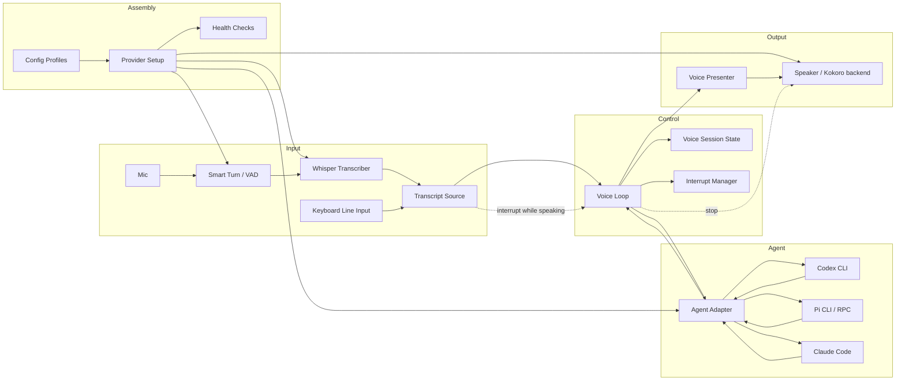
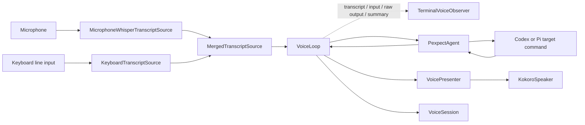
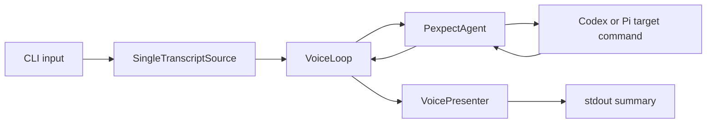
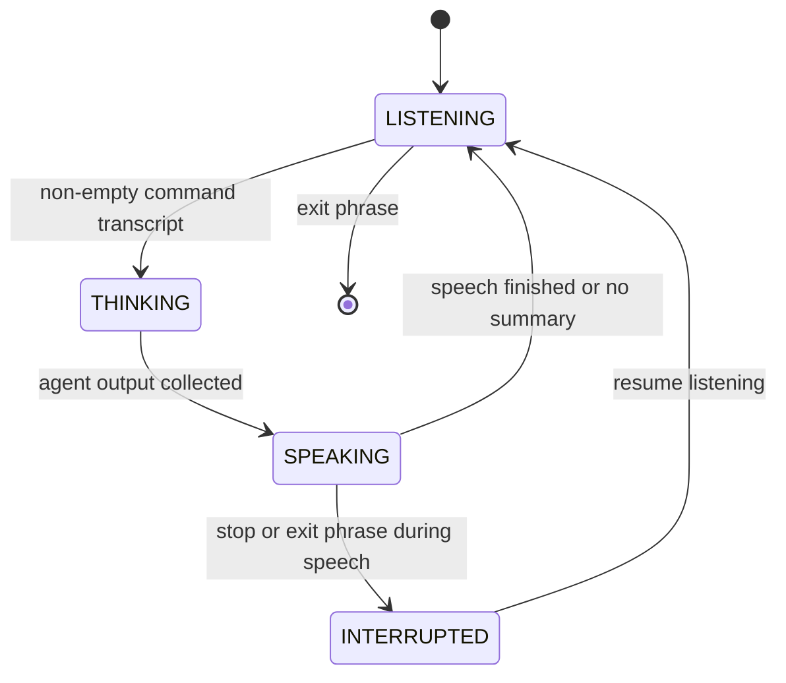

# Component Architecture

`agent-voice` is a local voice layer around terminal coding agents. The core
design is component-based: audio, agent control, presentation, interruption, and
provider assembly are separate boundaries.

The product value is not only the custom code. A large part of the value is
assembling compatible local components, setting sane defaults, and hiding the
rough edges between Smart Turn/VAD, Whisper, Kokoro, terminal agents, and
platform audio.

## Target Components



## Component Responsibilities

| Component | Responsibility | Current Status |
| --- | --- | --- |
| `TranscriptSource` | Supplies completed user utterances from text, Whisper, keyboard input, or another input provider. | Protocol implemented in `loop.py`; `MicrophoneWhisperTranscriptSource`, `KeyboardTranscriptSource`, and `MergedTranscriptSource` implemented in `providers.py`. Real-device tuning still needed. |
| `VoiceLoop` | Coordinates transcript handling, agent submission, output collection, presentation, speaking, terminal visibility events, and interruption. | Implemented as a test-backed runtime loop and wired to the default CLI voice path. Speech playback runs in the background while the loop polls for interrupt transcripts. |
| `AgentAdapter` | Starts a coding agent, sends user input, and reads available agent output. | Implemented as `PexpectAgent` plus an experimental `CodexAppServerAgent`; Pi still uses opaque target-argument passthrough. |
| `VoicePresenter` | Converts raw agent output into short speech-ready summaries. | Implemented as rule-based summaries. |
| `VoiceLoopObserver` | Emits transparent runtime events such as transcript, agent input, raw agent output, and speech summary. | Implemented in `loop.py` as an event callback contract; `TerminalVoiceObserver` renders it in the default provider. |
| `Speaker` | Speaks presenter output and supports `stop()` for barge-in. Kokoro is the intended default TTS backend. | Protocol implemented in `loop.py`; Supertonic/Kokoro speakers use `sounddevice`, and can feed LiveKit/WebRTC APM as an AEC reverse stream before playback. Real-device tuning still needed. |
| `VoicePresetConfig` | Resolves named TTS presets into provider settings such as voice, language/accent, and speech speed. | Implemented through bundled `voice_presets.toml`, optional `--voice-config`, `--voice-preset`, and explicit `--tts-*` CLI overrides. |
| `InterruptManager` | Decides whether a transcript should interrupt speech in the current state. | Implemented and wired into `VoiceLoop` and default CLI voice runtime. |
| `VoiceSession` | Tracks `LISTENING`, `THINKING`, `SPEAKING`, and `INTERRUPTED`. | Implemented. |
| `ProviderSetup` | Installs, configures, validates, and starts external providers such as Smart Turn/VAD, Whisper, Kokoro, and agent adapters. | Setup/profile installation is not implemented. Basic validation exists through `agent-voice doctor`. |
| `ConfigProfile` | Captures known-good local stack choices such as `local-cpu`, `apple-silicon`, `cuda`, `codex-only`, or `pi-rpc`. | Not implemented. |
| `HealthChecks` | Verifies mic access, model files, audio output, provider versions, agent command availability, and expected latency. | Initial `agent-voice doctor` is implemented for Python packages, agent command lookup, audio device discovery, and Kokoro cache status. Latency and playback/transcription deep checks are still future work. |

## Assembly Layer

The voice stack depends on several external components. `agent-voice` should
make those components feel like one product by managing configuration,
capability detection, startup order, and health checks.

Planned assembly responsibilities:

- Detect platform capabilities: OS, CPU/GPU, audio devices, Python version, and
  available agent CLIs.
- Select a profile: for example `local-cpu`, `apple-silicon`, `cuda`,
  `codex-pexpect`, or `pi-rpc`.
- Install or verify optional providers without forcing every dependency on
  every user.
- Download or locate model assets for Whisper, Smart Turn/VAD, and Kokoro.
- Validate that mic input, speaker output, and agent command execution work
  before starting the full loop.
- Start providers in the right order and expose clear diagnostics when one
  layer fails.

The intended user-facing shape:

```bash
uv run agent-voice doctor
uv run agent-voice setup --profile local-cpu
uv run agent-voice setup --profile apple-silicon
uv run agent-voice codex
```

`agent-voice doctor` is implemented as a read-only local readiness check.
Setup/profile commands are still planned; they should make the local voice
stack easier to configure, not just diagnose.

Voice preset selection is implemented as a small configuration layer:

```bash
uv run agent-voice --voice-preset jarvis_style codex
uv run agent-voice --voice-config ./voice-presets.toml codex
uv run agent-voice --supertonic-voice F2 --tts-speed 1.0 codex
uv run agent-voice --tts-backend kokoro --tts-voice af_bella codex
```

The default preset is `jarvis_style`. With `--tts-backend auto`, Korean speech
uses the Supertonic backend. The bundled `jarvis_style` preset maps to
Supertonic `M2`, a stock male assistant-style voice, not a celebrity or
character voice clone. Kokoro remains available as an explicit backend, but it
is not treated as the default Korean TTS provider.

Default TTS backends must be actively maintained enough to install cleanly in
the project `uv` environment. Backend candidates that require stale Python
versions, broken packaging, or conflicting core dependencies should stay out of
the default runtime and be considered only through isolated external-process
adapters.

Current verified provider smoke:

```bash
uv run python scripts/provider_smoke.py
```

This exercises Kokoro ONNX, faster-whisper, and Pipecat Smart Turn v3 together
without Torch/CUDA dependencies. It is a provider-level integration check, not a
mic/speaker hardware E2E test.

## Replaceable Provider Design

Adapter pattern is the right starting point, but it should be applied as small
provider protocols instead of one large "voice provider" interface. Each
external component should sit behind the narrowest contract the voice loop
needs.

Provider protocols should be stable:

```python
class TurnDetector(Protocol):
    def accept_audio(self, chunk: AudioChunk) -> TurnDecision: ...


class Transcriber(Protocol):
    def transcribe(self, audio: AudioSegment) -> Transcript: ...


class Speaker(Protocol):
    def say(self, text: str) -> None: ...
    def stop(self) -> None: ...


class AgentAdapter(Protocol):
    def start(self) -> None: ...
    def submit(self, text: str) -> None: ...
    def read_available(self) -> str: ...
    def stop(self) -> None: ...
```

Concrete providers can then change without rewriting the voice loop:

| Boundary | Default Candidate | Replaceable With |
| --- | --- | --- |
| Turn detection | Pipecat Smart Turn / VAD | Silero VAD, WebRTC VAD, custom semantic turn detector |
| Transcription | Whisper | faster-whisper, whisper.cpp, platform STT |
| Speech | Supertonic for Korean auto mode; Kokoro fallback; macOS `say` explicitly | Piper, Coqui, system TTS, hosted TTS if explicitly configured |
| Agent control | `PexpectAgent` | Pi RPC adapter, Claude structured adapter, tmux adapter |
| Presentation | `VoicePresenter` | rule-based presenter, LLM-backed presenter, agent-specific presenter |

Provider selection should happen outside `VoiceLoop`. The loop should receive
already-constructed components:

```python
profile = ConfigProfile.load("local-cpu")
providers = ProviderRegistry(profile).build()
loop = VoiceLoop(
    transcript_source=providers.transcript_source,
    agent=providers.agent,
    presenter=providers.presenter,
    speaker=providers.speaker,
    interrupt=providers.interrupt,
)
```

This keeps the core loop independent from Kokoro, Whisper, Pipecat, Codex, Pi,
and Claude Code implementation details.

Provider metadata should include:

- `name`: human-readable provider name
- `kind`: `turn_detector`, `transcriber`, `speaker`, `agent`, or `presenter`
- `capabilities`: streaming, local-only, GPU support, interruption support,
  structured events, languages
- `health_check`: fast validation command or function
- `setup_hint`: actionable installation/configuration guidance

Compatibility rules:

- A provider can be replaced if it satisfies the same protocol.
- Optional provider-specific features must be exposed as capabilities, not
  hardcoded type checks.
- `VoiceLoop` must depend on protocols, not concrete provider classes.
- Provider setup can know about external tools and model files. Core runtime
  components should not own installation or download logic.

Current code already applies this idea to agents through the `Agent` protocol
and `PexpectAgent`. The same pattern still needs to be added for turn
detection, transcription, speech, provider setup, and health checks.

## Current MVP Component Map

The current default runtime is the local voice MVP:



The text runtime remains as a development/debug path:



Current files:

- `src/agent_voice/adapter.py`: `Agent` protocol and `PexpectAgent`
- `src/agent_voice/cli.py`: target passthrough CLI, default voice entrypoint,
  `SingleTranscriptSource` text debug path, and output collection
- `src/agent_voice/loop.py`: `TranscriptSource`, `Speaker`, and `VoiceLoop`
  contracts
- `src/agent_voice/providers.py`: local mic/Whisper transcript source,
  Kokoro speaker, and managed voice-loop assembly
- `src/agent_voice/presenter.py`: speech summary generation
- `src/agent_voice/interrupt.py`: interrupt predicate and session state

## Voice Loop Contract

`VoiceLoop` is now a test-backed runtime component. It supports one-turn
processing with `run_once()`, batch draining with `run_until_idle()`, and
runtime polling with `run_forever()`. Silence or no transcript is not an exit
condition; the runtime keeps listening until an explicit exit intent such as
`이제 그만`, `종료`, `exit`, or `quit`.

The important interrupt behavior is also owned by the loop. When presenter
output is spoken, `VoiceLoop` starts `speaker.say(summary)` on a background
thread and continues polling `TranscriptSource` while the session is
`SPEAKING`. If an interrupt phrase such as `잠깐` arrives during playback, the
loop calls `speaker.stop()`, transitions through `INTERRUPTED`, and resumes
`LISTENING`.

Supertonic/Kokoro playback also feeds synthesized PCM into LiveKit/WebRTC
`AudioProcessingModule.process_reverse_stream()`, while microphone capture is
processed through `process_stream()` before VAD/Whisper. Non-interrupt
microphone transcripts observed while `SPEAKING` are still ignored as a second
guard against feeding the system's own spoken summary back into the coding agent
as a new command. Keyboard transcripts are different because they cannot be TTS
echo; those are queued and submitted on the next turn after speech finishes.

The current provider implementation wires `MicrophoneWhisperTranscriptSource`
and `KeyboardTranscriptSource` through `MergedTranscriptSource`, then connects
that source and the selected speaker into the default CLI voice path. The
terminal observer prints completed transcripts, exact agent input, raw agent
output, and the speech summary so the wrapper does not hide the underlying
Codex/Pi session. The next step is real hardware E2E tuning: mic thresholds,
AEC delay, TTS language/voice quality, latency, and clearer doctor checks.

Current shape:

```python
class TranscriptSource(Protocol):
    def next_transcript(self) -> TranscriptInput | None: ...


@dataclass(frozen=True)
class Transcript:
    text: str
    source: str = "unknown"


class Speaker(Protocol):
    def say(self, text: str) -> None: ...
    def stop(self) -> None: ...


class VoiceLoop:
    def run_once(self) -> bool: ...
    def run_until_idle(self, *, max_turns: int | None = None) -> int: ...
    def run_forever(
        self,
        *,
        max_polls: int | None = None,
        idle_sleep_seconds: float = 0.05,
    ) -> int: ...
```

Voice mode accepts two input paths by default:

- microphone audio: Smart Turn/VAD -> faster-whisper -> `Transcript(source="microphone")`
- terminal typing: line + Enter -> `Transcript(source="keyboard")`

Both paths enter the same `VoiceLoop`. If a typed command arrives while TTS is
speaking, it is queued for the next turn. Non-interrupt microphone transcripts
during speech are still ignored after LiveKit/WebRTC AEC as a conservative
guard against echo leakage.

The loop should own this decision:

```text
session.heard_command()
agent.submit(transcript)
raw_output = collect_agent_output(agent)
session.agent_responded()
summary = presenter.summarize(raw_output)

start speaker.say(summary) in background
while speaker is playing:
    transcript = transcript_source.next_transcript()
    if should_exit(transcript):
        speaker.stop()
        agent.stop()
        session.interrupt()
        session.resume_listening()
        break
    elif interrupt.should_interrupt(transcript, SPEAKING):
        speaker.stop()
        session.interrupt()
        session.resume_listening()
        break
    else:
        ignore transcript while speaking

if speech completes normally:
    session.tts_finished()
```

This is the point where fake end-to-end tests become meaningful: they can verify
the voice product loop instead of only verifying presenter output. The current
tests cover command submission, runtime polling through silence, explicit exit
intent, barge-in interruption while speech is playing, and ignoring
non-interrupt transcripts during playback.

## Agent Adapter Strategy

### Codex

Codex is controlled through `PexpectAgent` by default.

```bash
uv run agent-voice codex
```

An experimental structured backend can use Codex app-server JSON-RPC events:

```bash
uv run agent-voice --agent-backend codex-app-server codex
uv run agent-voice --agent-backend codex-app-server --text --once "OK 라고만 답해" codex
```

The app-server backend starts `codex app-server`, initializes a thread, submits
turns with `turn/start`, and renders assistant-message plus file-change events
into the existing presenter path. Command lifecycle events are intentionally not
rendered as speech by default.

This command starts the default voice mode. The text debug path is:

```bash
uv run agent-voice --text codex
```

Codex options are passed through after the `codex` target and are not parsed by
`agent-voice`:

```bash
uv run agent-voice codex resume
uv run agent-voice codex --model <model>
uv run agent-voice --text codex resume --model <model>
```

The text-mode adapter starts one long-lived Codex process with the same target
command and submits each typed command as terminal input.

### Pi

Pi uses the same pexpect target passthrough:

```bash
uv run agent-voice pi
uv run agent-voice pi -c
uv run agent-voice --text pi -c
```

Future Pi-specific adapters should prefer structured RPC or JSON event modes
over TUI scraping. Structured events are a better source for speech summaries,
agent state awareness, and interrupt behavior.

### Claude Code

Claude Code should follow the same adapter boundary. If only TUI control is
available, use a pexpect adapter. If structured events are available, prefer a
structured adapter.

## State Model



`VoiceSession` owns user-facing session state. Runtime shutdown is tracked
separately by `VoiceLoop.should_exit`; it is not currently a `SessionState`.

| State | Meaning | Active owner | What should be happening |
| --- | --- | --- | --- |
| `LISTENING` | Ready for the next user command. | `TranscriptSource` and `VoiceLoop` | Poll completed transcripts. No transcript means idle, not exit. |
| `THINKING` | A user command was submitted to the coding agent. | `AgentAdapter` and output collector | Wait for available agent output. |
| `SPEAKING` | Agent output has been summarized and is being presented. | `Speaker`, `VoicePresenter`, and `VoiceLoop` interrupt poller | Speak summary while still polling transcripts for interrupt or exit intent. |
| `INTERRUPTED` | Speech playback was stopped by the user. | `InterruptManager` and `VoiceLoop` | Stop speaker, then immediately return to `LISTENING`. |

Current transition triggers:

| From | To | Trigger | Code path | Notes |
| --- | --- | --- | --- | --- |
| initial | `LISTENING` | `VoiceSession()` construction | `VoiceSession.state` default | History starts with `LISTENING`. |
| `LISTENING` | `LISTENING` | `TranscriptSource.next_transcript()` returns `None` or empty text | `VoiceLoop.run_once()` | In `run_forever()`, this only sleeps briefly and polls again. Silence never stops the product runtime. |
| `LISTENING` | runtime stopped | Exit phrase such as `이제 그만`, `종료`, `exit`, or `quit` | `VoiceLoop.run_once()` -> `_should_exit()` | Calls `speaker.stop()`, `agent.stop()`, and sets `should_exit=True`. It does not submit text to the agent. |
| `LISTENING` | `THINKING` | Non-empty transcript that is neither exit nor interrupt | `VoiceLoop.run_once()` -> `session.heard_command()` | The transcript is then sent to `agent.submit(transcript)`. |
| `THINKING` | `SPEAKING` | Agent output collection completes | `VoiceLoop.run_once()` -> `session.agent_responded()` | The raw output is summarized by `VoicePresenter`. |
| `SPEAKING` | `LISTENING` | Summary speech finishes normally | `_speak_interruptibly()` -> `session.tts_finished()` | `speaker.say(summary)` runs in a background thread while the loop polls for interrupts. |
| `SPEAKING` | `LISTENING` | Presenter returns no speakable summary | `VoiceLoop.run_once()` -> `session.tts_finished()` | The state still briefly enters `SPEAKING` after agent response, then returns to `LISTENING`. |
| `SPEAKING` | `INTERRUPTED` | Stop phrase such as `잠깐`, `멈춰`, `stop`, or `pause` | `_handle_speaking_transcript()` -> `speaker.stop()` -> `session.interrupt()` | Only valid while speaking. The default behavior stops TTS, not the coding agent. |
| `INTERRUPTED` | `LISTENING` | Interrupt handling completes | `_handle_speaking_transcript()` -> `session.resume_listening()` | This transition is immediate in the current loop. |
| `SPEAKING` | `INTERRUPTED` -> `LISTENING` plus runtime stopped | Exit phrase during speech | `_handle_speaking_transcript()` -> `_should_exit()` | Stops speaker and agent, sets `should_exit=True`, then resumes listening state before the runtime loop exits. |
| `SPEAKING` | `SPEAKING` | Non-interrupt keyboard transcript during playback | `_handle_speaking_transcript()` | Queued in `VoiceLoop` and submitted on the next turn after TTS finishes. |
| `SPEAKING` | `SPEAKING` | Non-interrupt microphone/unknown transcript during playback | `_handle_speaking_transcript()` | Ignored to avoid echoing spoken summaries back into the agent as new commands. |

The important split is:

- Turn completion is input-level state: Smart Turn/VAD and Whisper decide when
  a transcript is ready.
- Session state is product-level state: `VoiceSession` tracks what the voice
  layer is doing with that transcript.
- Agent state is future work: Codex/Pi/Claude may expose richer progress such
  as "running tests" or "editing files", but that should be a separate agent
  observation model instead of overloading `VoiceSession`.

Default interrupt semantics:

- `잠깐`, `멈춰`, `stop`, or `pause` stops speech playback only.
- Stop phrases are interrupt commands only while the session is `SPEAKING`.
  Outside `SPEAKING`, they are not consumed by `InterruptManager`.
- It should not cancel the coding agent by default.
- `이제 그만`, `종료`, `exit`, or `quit` exits the voice runtime and stops the
  agent process.
- Future commands such as "cancel" can map to agent-level interrupt behavior
  like Ctrl-C.

## Testing Boundaries

Useful automated tests should match component ownership:

- Presenter tests: raw agent output to speech summary.
- Adapter tests: transcript text is submitted to the child process.
- VoiceLoop tests: transcript to agent to presenter to speaker, including
  speaking-time interruption.
- Real Codex/Pi tests: opt-in smoke tests only, because auth, latency, and model
  output are inherently flaky.
